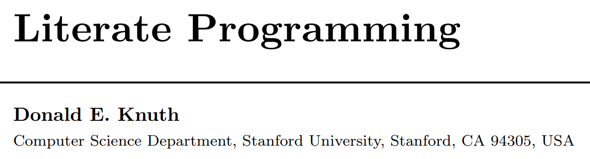

```{r setup, include=FALSE}
knitr::opts_chunk$set(echo = FALSE)
```

## Outline

* Literate Programming - The `WEB` System
* Dynamic Documentation - `SWEAVE`
* The Next Generation - `knitr` + `rmarkdown`
* Universal Document Converter - `Pandoc`
* The **RStudio** "HUB" via `rmarkdown`

## The `WEB` System by Donald Knuth

The first published literate programming environment was `WEB`. Donald Knuth introduced it back in 1981 combining his TeX typesetting system with the Pascal programming language.



<div class="quote-container2">

> _"I chose the name `WEB` partly because it was one of the few three-letter words of English that hadn’t already been applied to computers. But as time went on, I’ve become extremely pleased with the name, because I think that a complex piece of software is, indeed, best **regarded as a web that has been delicately pieced together from simple materials**. ... If we **express a program as a web of ideas**, we can emphasize its structural properties in a natural and satisfying way."_<footnote>http://www.literateprogramming.com/knuthweb.pdf</footnote>

</div>

## More Literate Programming Tools

Since WEB was introduced in 1981, many other programs implementing literate programming have emerged over time including:

* CWEB also created by Donald Knuth with Silvio Levy which was adapted for the C and C++ programming language instead of Pascal
* Axiom developed by IBM
* Noweb
* Literate
* Funnel WEB
* Molly 
* Codnar
* Jupyter Notebook (formerly IPython Notebook)
* R Notebooks

## `SWEAVE` by Friedrich Leisch


<div class="quote-container2">

> What is Sweave?

> _"Sweave is a tool that allows to embed the R code for complete data analyses in latex documents. The purpose is to create dynamic reports, which can be updated automatically if data or analysis change. Instead of inserting a prefabricated graph or table into the report, the master document contains the R code necessary to obtain it. When run through R, all data analysis output (tables, graphs, etc.) is **created on the fly and inserted** into a final latex document. The report can be **automatically updated if data or analysis change, which allows for truly reproducible research**."_<footnote>Friedrich Leisch. Sweave: Dynamic generation of statistical reports using literate data analysis. In Wolfgang Härdle and Bernd Rönz, editors, Compstat 2002 - Proceedings in Computational Statistics, pages 575-580. Physica Verlag, Heidelberg, 2002. ISBN 3-7908-1517-9.</footnote>

</div>

## The next evolution `<- knitr`

<div class="columns-2">

<div class="centered">
 
</div>

In 2012 Yihui Xie, created and released the `knitr` package for R to extend the capabilities of `SWEAVE` beyond LaTeX.

</div>

<div class="quote-container2">

> _"The **knitr** package was designed to be a transparent engine for dynamic report generation with R, solve some long-standing problems in Sweave, and combine features in other add-on packages into one package."_<footnote>[https://yihui.name/knitr/](https://yihui.name/knitr/)</footnote>

</div>

## The next evolution `<- ... + rmarkdown`

<div class="centered">
 
</div>

* In 2014, RStudio released `rmarkdown` to extend the `markdown` language originally intended to write documents for the "web" _(i.e. HTML)_.<footnote>[https://daringfireball.net/projects/markdown/syntax](https://daringfireball.net/projects/markdown/syntax)</footnote> 

* `rmarkdown` leverages `Pandoc` _("universal document converter")_ <footnote>[http://pandoc.org/index.html](http://pandoc.org/index.html)</footnote> to convert between formats: from HTML (readable by web browsers) to DOC (such as from Microsoft Word or Google Docs) to ODT (Libre Office) to PDF (portable document format) to others like EPUB (e-books), HTML5 slide shows (slidy, ioslides), and TeX based documents and slides (Beamer).

## Pandoc [https://pandoc.org/](https://pandoc.org/)

<span style="font-size: 20px;">...often called the _Swiss-Army knife_ for converting files from one format to another. Pandoc can convert documents in markdown, reStructuredText, textile, HTML, DocBook, LaTeX, MediaWiki markup, TWiki markup, OPML, Emacs Org-Mode, Txt2Tags, Microsoft Word docx, LibreOffice ODT, EPUB, or Haddock markup to</span>

<span style="font-size: 20px;"><div class="columns-1">

* HTML formats: XHTML, HTML5,Slidy, reveal.js, Slideous, S5, DZSlides.
* Word processor formats: Microsoft Word docx, OpenOffice/LibreOffice ODT, OpenDocument XML
* Ebooks: EPUB version 2 or 3, FictionBook2
* Documentation formats: DocBook, TEI Simple, GNU TexInfo, Groff man pages, Haddock markup
* Page layout formats: InDesign ICML
* Outline formats: OPML
* TeX formats: LaTeX, ConTeXt, LaTeX Beamer slides
* PDF via LaTeX
* Lightweight markup formats: Markdown (including CommonMark), reStructuredText, AsciiDoc, MediaWiki markup, DokuWiki markup, Emacs Org-Mode, Textile
* Custom formats: written in lua.

</div></span>

## The **RStudio**"HUB" 


## Next in Lesson 03 ... {.flexbox .vcenter}

Reproducible Principles & Practices

plus

Examples of Reproducible Documents & Templates

