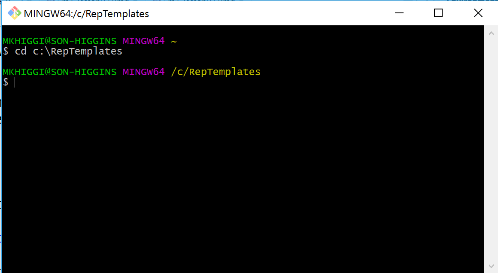
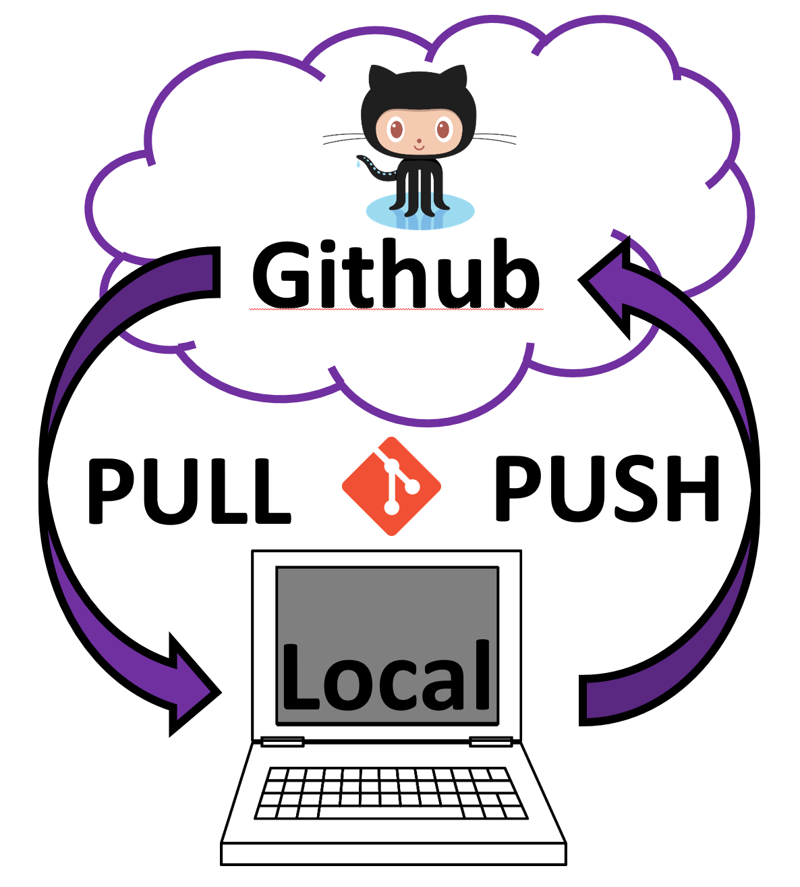
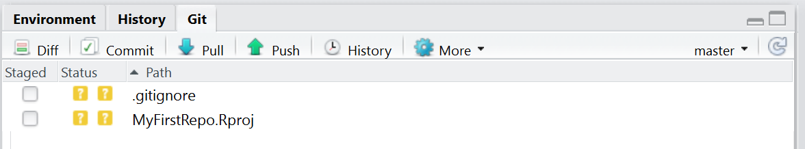
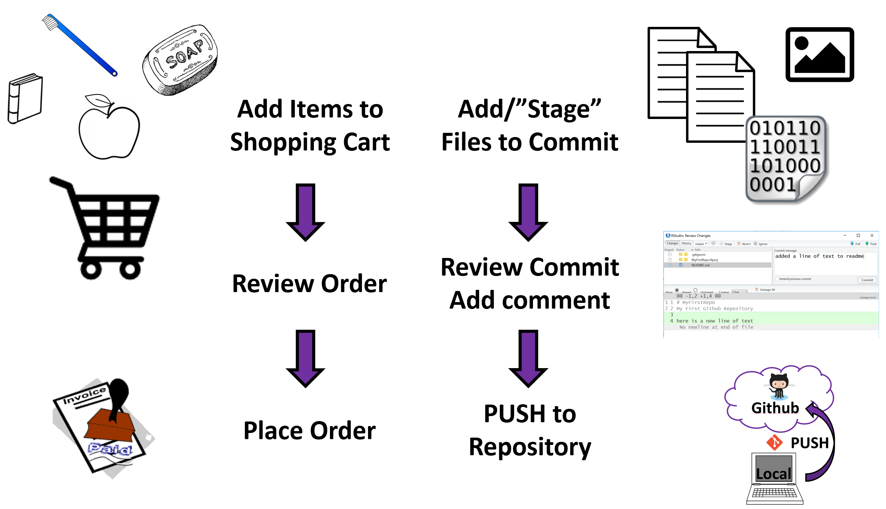
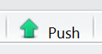
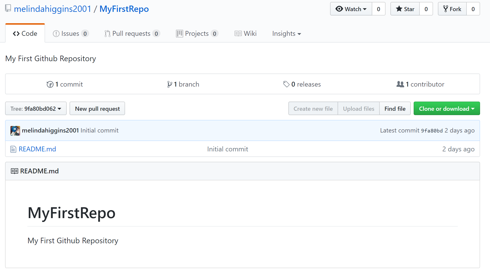

```{r setup, include=FALSE}
knitr::opts_chunk$set(echo = FALSE)
```

## Lesson 06 ... {.flexbox .vcenter}

<div style="font-size:200%">
Getting Started with
</div>

<p>  </p>


**Github**

& 


## A few assumptions for this lesson (and the whole course)

1. It is assumed that you know how to and have rights to install software on your computer
2. It is assumed that you know how to find files on your computer
3. It is assumed that you can create and delete files and directories on your computer
4. It is assumed that you have network access to the Internet and can access the websites listed in this (and other) lessons

## What is Github?? 

* [https://github.com/](https://github.com/)

**Github** is web-based **GIT** repository hosting service. It offers all of the distributed revision control and source code management (SCM) functionality of Git as well as adding its own features - for example, native interpretation of [*markdown*](https://daringfireball.net/projects/markdown/) which is MUCH easier to code/write than HTML - very lightweight code for creating documents.

**Github**, unlike Git, which is strictly a command-line tool, GitHub provides a Web-based graphical interface and desktop as well as mobile integration. **Github** provides access control and collaboration features such as bug tracking, feature requests, task management, and wikis for every project.

## Setting up your own Github Account

Go to [https://github.com/](https://github.com/)

1. Pick a Good Username for Your Github Account
    - Pick something that is professional and represents you.
    - This will be your identity on Github and will be viewable to everyone.
    - _NOTE: For this course, I assume that you are creating a PUBLIC Github account, which is FREE. You can create a PRIVATE Github account for a fee._

2. You can register one Github account per email.

3. Once you get logged in to your Github Account, go to your account settings to customize your photo, bio, email, website URL, and more...

4. When you first get started you won't have any repositories, but we will be creating repositories for each project.

## Github Settings


_...next let's install Git..._

## What is GIT??

* [https://git-scm.com/](https://git-scm.com/)

**GIT** is a widely used source code management system for software development. It was designed and developed in 2005 by Linux kernel developers (e.g. Linus Torvalds) for Linux kernel development. 

**GIT** is a distributed version control system with complete history & version-tracking capabilities. _[Other version control systems you may have heard of are Subversion, CVS, Perforce, and ClearCase]_ 

**GIT** is FREE (cost) & freely distributed under the terms of the GNU General Public License version 2. More @  [https://git-scm.com/](https://git-scm.com/)

## Download and install Git

* Go to [https://git-scm.com/](https://git-scm.com/) - click "Downloads"
* Pick the download link for your operating system - **NOTE** Clicking these links starts the file download.
* Next install Git, follow the instructions and accept the defaults.

## Let's test your Git and Github setup

1. Open your browser and log into your Github account
2. Click on your Profile, and then Click on Repositories
3. Click NEW to create a new repository.
    - type in a name for your repository such as "MyFirstRepo"
    - put in a short description like "My First Github Repository"
    - Go ahead and click the box to select "Initialize this repository with a README"
    - keep everything else the same (use the defaults)
    - click "Create Repository"

## Github - "My First Repo"


## Github - "My First Repo"


## Now let's connect using Git

1. Create a directory on your local drive where you want to save copies of your Github repositories for this course.
    - For example, create a directory "RepTemplates" on your "C" drive, for example `C:\RepTemplates`
2. Find where Git was installed on your computer. There are 3 options for running Git:
    - "Git Bash" - we will use this one
    - "Git CMD" - similar to Git Bash, but we will not use
    - "Git GUI" - a very simple Graphical User Interface (GUI) - we will not use
3. Run the "Git Bash" option - This opens another window
4. Change to your newly created directory by typing `cd C:\RepTemplates` _(as shown on next slide)_

## Git Bash Window



## Happy Git and Github for the useR

To get more information about the Git commands we're using and getting connected to your Github account, we will refer to the  details provided in the "Happy Git and GitHub for the useR" book by Jenny Bryan. It is available online for FREE at [http://happygitwithr.com/](http://happygitwithr.com/)

In this lesson we will cover some of the information in these chapters:

* Chapter 8: "Introduce Yourself to Git"
* Chapter 9: "Install a Git Client"
* Chapter 10: "Connect to Github"
* Chapter 11: "Cache credentials for HTTPS"
* Chapter 12: "Set up keys for SSH"
* Chapter 26: "Burn it all down"

## Introduce yourself to Git

_[Be sure you are already logged into your Github account.]_ First, introduce yourself to Git - type the following 3 commands in your Git Bash window. Put in your name and email you used to set up your Github account. 

```
git config --global user.name 'Jennifer Bryan'
git config --global user.email 'jenny@stat.ubc.ca'
git config --global --list
```
Keep your Git Bash window open.

## "pushmi-pullyu" {.columns-2}

The pushmi-pullyu was a fictional animal in the _**Doctor Dolittle**_ series of children's books by Hugh Lofting with two heads on opposite ends of its body.

We will be PUSH'ing and PULL'ing content in and out of your project repository between your local computer and your Github account using Git version control. 

A PULL moves content from the cloud to your local computer.

A PUSH moved content from your local computer to the cloud.

<div class="centered">

</div>

## Clone your Github repo

Next we'll connect to Github and PULL a copy of your new repository "MyFirstRepo" to your local drive `C:\RepTemplates`

In your Git Bash Window you will use the `git clone` command. However, you also need the URL address for the repository. The easiest way to look this up is to go back to your Github account, click on the "MyFirstRepo" repository. Then click on the green button to "Clone or Download" to see the URL, then click the button on the right to "Copy the URL to the clipboard"

<div class="centered">

</div>

## First PULL to Clone your repository {.columns-2}

For this first "Clone" of your Github repository, you will PULL the content from your Github repository down to your local computer.

<div class="centered">

</div>

## Git Bash - First PULL to Clone your repository

In the Bit Bash window, type the git commands listed below - Be sure to use YOUR URL to YOUR Github Repo "MyFirstRepo".

If everything works fine, when you first type `ls` which "lists" the content of the directory, you should see that a new directory was created for your new repository `MyFirstRepo` under the `C:\RepTemplates` directory.

Then you can `cd` "change directory" to `MyFirstRepo` and run `ls` again to see the one file in your repository `README.cd`.

```
git clone https://github.com/YOUR-USERNAME/MyFirstRepo.git
ls
cd MyFirstRepo
ls
```

_... see next slide ..._

## Git Bash - Example Cloning


Congratulations!! You are now connected to Github with Version Control using Git.

Let's do this again using RStudio...

## Connecting RStudio to Github

<div class="columns-2">

* Make sure you are logged into your Github account at [https://github.com](https://github.com).

* Start RStudio and keep it open

* In RStudio, go to the Menu at the top for Tools/Global Options -
Click on Git/SVN

<div class="centered">

</div>

</div>

## Connecting RStudio to Github

<div class="columns-2">
<div class="centered">

</div>

* Make sure "Enable version control interface for RStudio projects" is checked

* Git executable - find where `git.exe` is on your local drive - this is the executable file which runs Git. Mine is located at "C:/Program Files/Git/bin/git.exe"

* We will not be using SVN so this is "not found" or blank

</div>

## Credentials

* Each time you make a change and want to sync up your changes either from your local drive to the Github cloud or from the cloud to your local drive, you need to pass your credentials to Github.
* You can do this by typing in your Github username and password each time - huge pain - or you need to set up credentials on your computer
* You can use either the HTTPS (**H**yper **T**ext **T**ransfer **P**rotocol **S**ecure) or SSH (**S**ecure **SH**ell) credentialing approaches
* Chapter 11 in "Happy Git and Github for the userR" covers how to do use HTTPS
* Chapter 12 in "Happy Git and Github for the userR" covers how to set up SSH - I'll show how to do this from RStudio on the next slide

## SSH RSA Key - generate from RStudio

<div class="columns-2">

* SSH RSA Key is for setting up a _**public key-private key**_ cryptosystem for secure data transmission
    - SSH = Secure SHell
    - RSA = Rivest–Shamir–Adleman

* Click "Create RSA Key"
    - put in optonal passphrase (password)
    - click "Create"
    - your SSH key will be generated at the location listed

<div class="centered">


</div></div>

## Check that Git sees your SSH Key

* Go back to your Git Bash window and check to see if Git also sees your new SSH key. 

* In your Git Bash window type `ls -al ~/.ssh`

* You should now see a pair of files listed like `id_rsa` and `id_rsa.pub`

* See Section 12.2 in "Happy Git and Github for the useR" [http://happygitwithr.com/ssh-keys.html](http://happygitwithr.com/ssh-keys.html)

* you can also click the `? Using Version Control with RStudio` to get to RStudio's help website 

## Quick Checklist - Recap

* Github Account created
* Logged into your Github Account
* Created a new Github repository "MyFirstRepo" - keep your browser open and logged in to your Github account and repository
* Git Bash Window is open and
* You are in your local directory for your new repository (type `pwd` for a quick check, `pwd` stands for "path with directory")

<div class="centered">

</div>

## Quick Checklist - Recap

* Check Git connection - make sure your correct email for your Github account is listed - type this command in your Git Bash window

<div class="centered">
`git config --global --list`
</div>

* Check SSH key - make sure you see the `id_rsa` and `id_rsa.pub` listed - type this in your Git Bash window

<div class="centered">
`ls -al ~/.ssh`
</div>

_NOTE: If you still get errors there is a chance you might have a credentialling conflict. If you have multiple Github accounts and switch between them, sometimes you have to remove the previous credentials and re-add your credentials for the other account. Search Stack Overflow and Github documentation for help._

## Create New RStudio Project with Git Version Control

<div class="columns-2">

* Go back to RStudio

* Click File/New Project

* Choose the "Version Control" option


<div class="centered">

</div></div>

## Create New RStudio Project with Git Version Control

* Choose Git to "Clone a project from a Git repository"

<div class="centered">

</div>

## Create New RStudio Project with Git Version Control {.columns-2}

* Go to your Github repository
    - click on the Clone or Download GREEN button 
    - we'll use the HTTPS option 
    - copy the URL to the clipboard

<div class="centered">

</div>

* "Open in Desktop" is for using the Github Desktop application which we will not use in this course.
* Download ZIP is very useful for getting copies of ANYONE's Github repository - but this only works offline and is not linked back to Github. This is great for seeing how other people setup their Github repositories and projects!

## Create New RStudio Project with Git Version Control

<div class="columns-2">

* Go back to RStudio paste the URL into the New Project dialog box on the 1st line for Repository URL - notice that the 2nd line is autopopulated - use these defaults. 

* Check the directory locations on the 3rd line "Create project as a subdirectory of:" We have `C:\RepTemplates` If needed Browse to another location on your local drive.

<div class="centered">

</div>
</div>

## Create New RStudio Project with Git Version Control

<div class="columns-2">

* Note: You can also click the little box on the bottom left for "Open in new session" if you want to open a new instance of RStudio. 
* For now, leave this UNCHECKED. Click "Create Project"

<div class="centered">

</div>
</div>

## ERROR

<div class="columns-2">

* If you got an error like this one...

* Don't Panic. 

* This ERROR occurred because we've already cloned this repository previously using `git`

* Go to your file directory on your local computer and DELETE the previous clone of `C:\RepTemplates\MyFirstRepo`. 

* Once you've deleted this directory and these files, clone the repository again... _(see next slide)_

<div class="centered">

</div>
</div>

## RStudio - Redo New Project

* In RStudio, run through File/New Project/Version Control/Git/ and put in the URL for the repository again, click "Create Project" - this time it should work.

* RStudio will restart and that's ok. 
    - There is a little window that pops up briefly stating that it is "cloning" your repository. 
    - This is basically the same step we previously when we typed `git clone https://github.com/YOUR-USERNAME/YOUR-REPOSITORY.git` but now RStudio did the `git` commands for you. 
    - This is great! Much less typing of `git` commands!!
    
## RStudio - New project

* You should now see on the bottom right that your "Files" window shows your current working directory is "C:\RepTemplates\MyFirstRepo" and there are 3 files
    - `.gitignore` - this has some `git` instructions on what files to ignore
    - `MyFirstRepo.Rproj` - this has some settings on your new RStudio project setup
    - `README.md` - this is only file in your current Github repository - it is in plain `markdown` format
    
<div class="centered">

</div>

## RStudio - New project

* You will also notice at the top right, you have 3 TABS: 
    - one for "Environment"
    - one for "History"
    - and one for "Git" - this indicates you are up and connected to Github

<div class="centered">

</div>

## Connected to Github via Git

* Click on the `git` TAB at top left - it shows that the `.gitignore` and `MyFirstRepo.Rproj` files are new since they were created by RStudio when you created the new project - these files are currently on your local drive and NOT _(yet)_ in the Github repository.

<div class="centered">

</div>

## Make a Change - we'll Sync it up next

<div class="centered">

</div>
* Click on the `README.md` file - it will open up in the RStudio editor window at the top left.
* Add a second line of text like "here is a new line of text"

<div class="centered">

</div>
* Click save

## See changes on Git TAB

Notice that in the `git` TAB it shows that the `README.md` file has changed (or been modified) - this is indicated by the little blue "M" icon next to `README.md`

<div class="centered">

</div>

## "Stage", "Commit", "PUSH"

We will follow a workflow process of "Stage" -> "Commit" -> "PUSH" which is analogous to online shopping where you put items in your shopping cart, review your order, and then place your order.

<div class="centered">

</div>

## Using RStudio to "Stage" changes

* Go back and look at the `README.md` file in your Github repository back in your browser - notice it does not have the new line of text. This is because we have not yet committed our changes to the Github repository.

* To **add** (or **"Stage"**) your changes just made on your local drive using RStudio, we need to **commit** our changes to the `README.md` file and then **PUSH** them to your Github repository

* Click the box next to `README.md` to "stage" (or "add") your changes

<div class="centered">

</div>

## Using RStudio to "Commit" changes {.columns-2}

* Click "Commit" 

* This opens another dialog window showing the changes you made to your `README.md` file. This gives you a chance to review the changes you made and make sure you want to keep them - this is one last review, like reviewing your order before you place it.

* You should also type in a comment here about what this commit will change in your repository (i.e. files added, changed or deleted and why).

<div class="centered">

</div>

* Git Humor
    - [https://xkcd.com/1296/](https://xkcd.com/1296/)
    - [http://happygitwithr.com/comic-relief.html](http://happygitwithr.com/comic-relief.html)

## Using RStudio to commit changes

* Click commit - you should get back a message about the changes that will be made - then click Close

<div class="centered">

</div>

* We are not yet done - we still have to "Buy/Purchase our order" - we have to PUSH our "commit" to Github

## Using RStudio to commit changes

* The next step - Click Green Up Arrow to **PUSH**  your changes to your Github repository - it takes a minute to run but you should see something like below with no errors.

<div class="centered">

</div>

* Refresh your Github repository in your browser window you should now see your new line of text in your `README.md` file.

## Before/After {.columns-2}

<div class="centered">
<p> BEFORE
<br>

</div>
<div class="centered">
<p> AFTER
<br>

</div>

## See your changes in Github

* Go to your browser window for your Github repository

* Notice that there is a commit message "added a line of text to readme" with a date/time stamp listed on when this change was made.

* click on the `README.md` file - it will open this file in the browser window

* In this window you have the option to view the **RAW** `README.md` file, which is basically text

<div class="centered">

</div>

## Track Who did Changes in Github

* Click **BLAME** to see who made changes to this file and when

<div class="centered">

</div>

## The History of Changes in Github

* Click **HISTORY** to also see details on each commit - from here you can browse to that point in time to see what the repository looked like when that change was made. 

* There is also a little number listed - this is a SHA code that is assigned for explicitly tracking each change made in the repository. 
<div class="centered">

</div>

Learn more: [https://help.github.com/articles/github-glossary/](https://help.github.com/articles/github-glossary/) and [https://help.github.com/](https://help.github.com/)

## Make a change on Github and PULL it to your local repo {.columns-2}

* Click on `README.md` in your Github repository (in browser), click the icon that looks like a pencil to edit `README.md`


* Type in another line of text to change the `README.md` file online in your Github repository

* Scroll down to the bottom of the page, type in a short message about what you changed - click "Commit Changes"

<div class="centered">

</div>

## PULL these new changes to your local project using RStudio {.columns-2}

* Now what you have on Github is "ahead" of what you have on your local drive. 
* You need to PULL these changes down to your local drive.
* Go back to RStudio, click on the Git TAB and click the blue down arrow to PULL down your changes 
* You should get back a message similar to this

<div class="centered">

</div>

* You should now see the changes in the `README.md` file inside RStudio.

**TADA! You are now successfully using version control!**

## Using Git Bash to commit changes

Sometimes using the interface to Git inside RStudio can be cumbersome and slow and when handling a lot of changes or a lot of files at once, it can crash or hang-up. So, the Git command line is often useful to also know how to use.

Let's make another change to your `README.md` file, but this time, we'll **Stage**, **Commit** and **PUSH** the changes using the Git Bash window

## Using Git Bash to commit changes {.columns-2}

* Using RStudio, add one more line of new text to your `README.md` file and save your changes
* BUT, this time we will NOT use RStudio to commit the changes to Github - we'll use the Git Bash window instead.
* Go back to your Git Bash window
* Make sure you are in your repository directory

<div class="centered">

</div>

* Type in `git status` and you should see the files that have  changed on your local drive (<font size="5" color="red">red text</font> in window above) that are different from what is in the Github repository.

## Using Git Bash to Stage, Commit & PUSH {.columns-2}

"Stage" your changes using `git add .`

"Commit" your changes using `git commit -m "add third line of text to readme"`

"Push" your changes using `git push`

Check to see if everything sync'd back up `git status`

Success!

<div class="centered">

</div>

## Using Git Bash to PULL changes from Github to local

If you made changes in the Github repository online and you want to PULL the local changes down, make sure you are in the correct folder and then simply type `git pull` in your Git Bash window and the changes will sync up with local drive.

<div class="centered">

</div>

## When everything goes wrong

<span style="font-size: 24px;"><div class="columns-1">

It is not a question of "IF" but "WHEN" everything goes wrong and the Git process stops working. Read Chapter 26: "Burn it all down" in "Happy Git and Github for the useR",  [http://happygitwithr.com/burn.html](http://happygitwithr.com/burn.html)

If/When something really goes wrong:

* Make a backup copy of your repository on your local drive. 
* Delete the one that is not working
* Go back to Github and delete the repository that is not working
* Create a new repository again on Github
* Create a new project in RStudio using version control with Git
* Copy the backed up files on your local drive into the new folder with the recently recreated Github repository
* Stage, Commit and PUSH these changes from your local drive back up to Github. 
* Hopefully, everything will work going forward.

</div></span>

## Other Git Clients

Besides using Git either from the Git Bash command line or from inside RStudio, there are many other clients (software) that can be used.

If you plan to use more extensive version control or plan to use this approach working in teams, I highly encourage you to explore more full featured Git clients. 

Jenny Bryan covers these very well in Chapter 9 "Install a Git Client" in "Happy Git and Github for the userR"

Her two top recommendations are:

* SourceTree [https://www.sourcetreeapp.com/](https://www.sourcetreeapp.com/) and
* GitKracken [https://www.gitkraken.com/](https://www.gitkraken.com/)

For this course, the RStudio interface and the Git Bash window will be sufficient. You should only need a basic understanding of Git to complete this course. But I encourage you to explore these other Git clients for future projects.


## Getting Help

Jenny Bryan's "Happy Git and Github for the useR" [http://happygitwithr.com/](http://happygitwithr.com/) is a wealth of knowledge and a great place to start for everything necessary linking Git and Github with RStudio.

You can also seek help at:

* [https://www.rstudio.com/](https://www.rstudio.com/)
* Hadley Wickham's site for R packages on setting up Git and Github at [http://r-pkgs.had.co.nz/git.html#git-init](http://r-pkgs.had.co.nz/git.html#git-init)
* and both Google [https://www.google.com/](https://www.google.com/) (or any other search engine) and Stack Overflow [https://stackoverflow.com/](https://stackoverflow.com/) are great places to find help. Sometimes the best way is to type in the error message you are getting and keep looking for related articles and postings on the web to find an answer that helps you.

## Congratulations!! 

<div style="margin-left:+100px; margin-top:+100px; width:80%; height:100%">

I know this was a long lesson, but, hopefully, you now have all of the software installed and working and have worked through the issues getting Git and Github working and linked into your RStudio setup. 

<div class="centered">
<br>
<span style="font-size: 36px;">
**Feel proud this is a major milestone!!**
</span>
<br>
</div>

</div>

## Next in lesson 07 ... {.flexbox .vcenter}

* Make your first reproducible document 
    - using `rmarkdown` 
    - tracked with version control and 
    - linked to your Github repository
